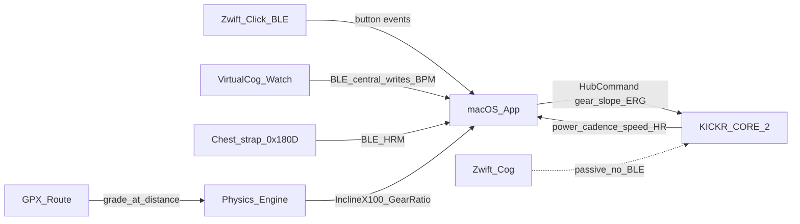
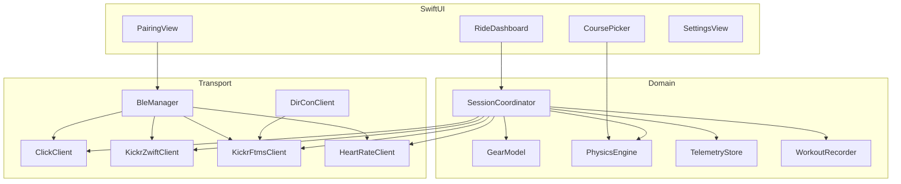

# Native macOS Virtual Cog Training Client — Plan

## Product scope

A **native macOS training client + physics course runner**:

- Pair **Wahoo KICKR CORE 2** and **Zwift Click**
- Full **virtual shifting** (1–24 gears) via Click
- **Slope simulation** and **ERG** target power
- Live telemetry comparable to what Zwift gathers from the trainer/sensors
- **GPX/route-driven** grade progression
- Session history and **FIT** export
- **Heart rate** from a BLE HRM or **VirtualCog Watch** (Apple Watch does not expose live HR to Mac natively)

**Not in scope:** a 3D Zwift-like world, multiplayer, Zwift game servers, or official Zwift Partner certification.

Repo status: greenfield (`virtual-cog` README + Xcode `.gitignore` only).

---

## Hardware reality (critical)



| Device | Role in the stack |
| --- | --- |
| **Zwift Cog** | Passive mechanical single-speed cog. **No electronics, no BLE, no pairing.** Virtual shifting does not “talk to” the Cog. |
| **Zwift Click** | BLE shifter. Plus/Minus → app gear index → trainer gear ratio. |
| **KICKR CORE 2** | Applies resistance from Zwift Hub protocol (native VS) and/or FTMS; streams power/cadence/speed; can bridge HR (KICKR Bridge). Firmware for VS: ≥ **2.2.44 / 3.2.44**. |

Virtual shifting on CORE 2 works when the app speaks **Zwift’s proprietary trainer BLE service** (same path Zwift/Rouvy use). The Cog only simplifies the physical drivetrain for multi-bike households.

---

## Recommended stack

| Layer | Choice |
| --- | --- |
| UI | SwiftUI (+ AppKit for menus / BLE permission UX) |
| BLE | CoreBluetooth |
| Click crypto | CryptoKit / Security (ECDH P-256, HKDF-SHA256, AES-CCM) |
| Messages | `swift-protobuf` from reverse-engineered `.proto` |
| Optional DirCon | Network.framework + Bonjour `_wahoo-fitness-tnp._tcp` |
| Persistence | SwiftData / SQLite |
| Export | FIT encoder (Garmin FIT SDK or community Swift encoder) |
| Packaging | Xcode macOS app, Bluetooth entitlement, Hardened Runtime |

---

## Architecture



### Suggested module layout

```
VirtualCog/
  App/                 # entry, entitlements UX, window scenes
  BLE/                 # CBCentralManager wrapper, scan, reconnect
  Devices/
    Click/             # handshake, decrypt, ClickKeyPadStatus
    HeartRate/         # BLE HRM central (0x180D)
    Kickr/             # Zwift Hub client + FTMS/CPS fallback
  Physics/             # gear→ratio, weights, SIM/ERG policy
  Course/              # GPX parse, elevation smooth, distance→grade
  Session/             # ride loop, mode switching, reconnect
  Telemetry/           # live metrics + aggregates
  Workout/             # FIT/CSV export
  UI/                  # pairing, dashboard, course profile
```

---

## Protocol connections

### 1. Zwift Click (BLE)

**Service:** `00000001-19ca-4651-86e5-fa29dcdd09d1`

| Characteristic | UUID suffix | Use |
| --- | --- | --- |
| Measurement | `…0002…` | Notify (button / idle) |
| Control Point | `…0003…` | Write commands |
| Command Response | `…0004…` | Indicate / read |

**Discovery:** advertisement manufacturer ID `0x094A`, controller type byte `9` = Click.

**Handshake (classic Click / Play path):**

1. Exchange `RideOn` + ECDH P-256 public keys
2. Derive shared key via ECDH → HKDF-SHA256 (36 bytes; salt = device pubkey ∥ app pubkey)
3. Encrypt/decrypt with **AES-CCM** (4-byte LE counter + ciphertext + 4-byte MIC)
4. Detect firmware variants that drop encryption (Ride-style plain `RideOn`) and branch

**Messages:** opcode `0x37` + protobuf `ClickKeyPadStatus` (`Button_Plus`, `Button_Minus`). Idle opcode often `0x15` / `0x19`. Optional haptic via opcode `0x12`.

**References (interoperability research, unofficial):**

- https://www.makinolo.com/blog/2023/10/08/connecting-to-zwift-play-controllers/
- https://github.com/ajchellew/zwiftplay
- https://github.com/jat255/Zwift_click_handling
- OpenBikeControl / swiftcontrol `zwift.proto`

### 2. KICKR CORE 2 — Zwift Hub path (primary for native VS)

Same proprietary service UUID family as Click/Ride. Trainer path handshake ≈ Ride: **`RideOn`, typically unencrypted** (see Makinolo trainer protocol notes).

| Direction | Opcode | Payload |
| --- | --- | --- |
| In | `0x03` | `HubRidingData`: Power, Cadence, SpeedX100, HR, … |
| Out | `0x04` | `HubCommand`: PowerTarget, SimulationParam, PhysicalParam |
| Out | `0x00` | Info queries (e.g. gear-ratio probe `520`) |

**SimulationParam**

- `Wind` — m/s × 100 (Zwift often fixes `0`)
- `InclineX100` — grade % × 100
- `CWa` — CdA × 10000 (Zwift-like default ≈ `5100`)
- `Crr` — rolling resistance × 100000 (Zwift-like default ≈ `400`)

Wrong Crr/CWa scaling makes gears/slope feel broken — treat scaling as golden-test critical.

**PhysicalParam**

- `GearRatioX10000` — virtual gear ratio
- `BikeWeightx100`, `RiderWeightx100`

**Session control loop**

1. On start: write rider/bike weight; establish neutral baseline when pedaling starts (trainer uses physical chainring/cog ratio once — mid gear ≈ 12/24).
2. On Click shift: update gear index (1–24 linear) → write `GearRatioX10000`.
3. On course progress: grade % → `InclineX100`.
4. ERG blocks: `PowerTarget`; virtual shifting feel is SIM-only (disable VS updates while ERG active).

**Reference:** https://www.makinolo.com/blog/2024/10/20/zwift-trainer-protocol/

### 3. FTMS / CPS fallback (always implement)

Standard Bluetooth SIG services on KICKR:

| Service | UUID | Use |
| --- | --- | --- |
| Fitness Machine | `0x1826` | Indoor Bike Data notify; Control Point for Request Control, Indoor Bike Simulation, Target Power |
| Cycling Power | `0x1818` | Secondary power stream / Wahoo extensions |
| Device Information | `0x180A` | Firmware / serial |
| User Data | `0x181C` | Rider weight (FTMS path) |
| Wahoo Virtual Bike | `a026ee0d-…` | KICKR Bike-style groupset/buttons (secondary; CORE 2 VS with Click still goes through Zwift Hub path) |

Use FTMS when Hub is unavailable, for comparison, and for apps that must stay on open standards. Prefer **Hub** for CORE 2 native virtual shifting.

FTMS Indoor Bike Simulation Parameters are the open alternative for slope; Target Power is ERG.

### 4. Optional: Direct Connect / Wi‑Fi

CORE 2 supports Wi‑Fi / bridge features. Classic **DirCon** is BLE-GATT-over-TCP:

- Bonjour service `_wahoo-fitness-tnp._tcp`
- Often TCP port `36866`
- Single client connection
- Same GATT semantics over a framed TCP protocol

Ship BLE first; add DirCon as a transport backend behind the same `KickrClient` interface.

Community reference: https://github.com/Berg0162/DirCon

### 5. Telemetry model (“what Zwift usually gathers”)

Collect, display, and log:

| Metric | Source |
| --- | --- |
| Instant / avg / max power (W) | Hub `0x03`, FTMS Indoor Bike Data, CPS |
| Cadence (rpm) | Hub / FTMS |
| Speed (km/h) | Hub virtual speed vs FTMS wheel speed (expose both if they differ) |
| Heart rate | Trainer bridge, BLE HRM `0x180D`, or VirtualCog Watch (HealthKit → Watch central writes to Mac ingest peripheral) |
| Grade % | Course engine → Hub/FTMS incline |
| Virtual gear + ratio | GearModel + Hub PhysicalParam / query |
| Trainer mode | SIM / ERG / Level |
| Distance, elevation gain, moving time | Session integrator |
| Optional load | NP/IF/TSS-style estimates |
| Click battery, RSSI | BAS `0x180F`, CoreBluetooth |
| Device firmware / serial | DIS |

---

## Physics + course runner

### Gear model

- **24 linear virtual gears** (Wahoo/Zwift fixed progression; not customizable groupsets like KICKR BIKE).
- Store ratio table as constants; allow a calibration offset after baseline lock.
- Debounce Click presses; ignore repeats while held; optional haptic ACK.

### Resistance ownership

The app does **not** micro-manage the trainer motor when using Hub SIM. It sends:

- grade (`InclineX100`)
- gear ratio (`GearRatioX10000`)
- weights + Crr/CWa

Trainer firmware computes load. App-side physics is for:

- advancing along the GPX by virtual/wheel speed
- computing grade from elevation
- UI profile cursor
- ERG target schedule

### Course module

1. Import GPX → track points with elevation
2. Smooth elevation; compute grade over a distance window
3. Build distance → grade lookup
4. Each tick: `distance += speed * dt` → new grade → trainer incline write
5. UI: elevation profile + optional MapKit polyline
6. Pause / resume / end session

---

## UI (MVP screens)

1. **Setup** — scan/pair KICKR + Click, rider/bike weight, connection status, “quit other BLE apps” notice
2. **Ride** — power / cadence / HR / speed, gear, grade, course progress; SIM ↔ ERG toggle
3. **Courses** — GPX library, select, start
4. **History** — past rides, FIT export

This product is a training dashboard after pairing; keep each screen to one job.

---

## Implementation phases

### Phase 0 — Project skeleton

- Xcode macOS SwiftUI app target
- Entitlement: Bluetooth (`com.apple.security.device.bluetooth` / usage description)
- SPM: SwiftProtobuf
- Module folders as above
- Protocol buffer stubs checked in under `Devices/Shared/zwift.proto`

### Phase 1 — FTMS telemetry

- Scan for FTMS `0x1826` / name filter KICKR
- Connect, subscribe Indoor Bike Data
- Live dashboard: power, cadence, speed
- Prove CoreBluetooth stability on macOS

### Phase 2 — FTMS control

- Request Control → Start
- Set Indoor Bike Simulation Parameters (manual grade slider)
- Set Target Power (ERG)
- Fitness Machine Status handling / control lost recovery

### Phase 3 — Zwift Hub trainer protocol

- Discover proprietary service on CORE 2
- `RideOn` handshake
- Parse `HubRidingData` (`0x03`)
- Send `HubCommand` (`0x04`) for weights, incline, power
- Side-by-side Hub vs FTMS metrics for validation

### Phase 4 — Zwift Click + virtual gears

- Scan Click; ECDH/AES-CCM (and plain RideOn fallback)
- Decode `0x37` keypad status
- `GearModel` 1–24 → `GearRatioX10000`
- Confirm load changes under constant cadence on a flat SIM grade

### Phase 5 — Course runner + session

- GPX import + grade lookup
- Session state machine (idle → connected → riding → paused → ended)
- Reconnect with backoff for Click and trainer
- FIT export (power, cadence, HR, speed, grade, distance, timestamps)

### Phase 6 — Hardening

- DirCon / Wi‑Fi transport
- Direct HR strap pairing **and Apple Watch BLE HR** (Watch is the central; Mac advertises an ingest service because watchOS cannot be a BLE peripheral)
- Simple ERG workout builder (ZWO-like intervals)
- Firmware quirk matrix (Click encryption variants, CORE 2 Hub quirks)
- BLE mock fixtures for CI without hardware
- Packet golden tests for CCM and protobuf scaling

---

## Risks and mitigations

| Risk | Mitigation |
| --- | --- |
| Zwift proprietary protocol changes with firmware | Isolate codecs; version-detect handshake; keep FTMS fallback |
| AES-CCM / HKDF easy to mis-implement | Golden vectors from open RE projects; unit tests before hardware |
| macOS BLE flaky with multiple centrals | Single `CBCentralManager`; exclusive connections; clear UX to quit Zwift/Wahoo |
| Wrong Crr/CWa / incline scaling | Capture-based golden packets; start from documented Zwift defaults |
| Legal / branding | Unofficial interoperability only; no Zwift trademarks/assets/servers; no Cog “driver” claims |
| Hardware required for full validation | Phased mocks; document manual test checklist with real CORE 2 + Click |

---

## Apple Watch pairing (live HR)

Apple Watch **cannot** advertise Bluetooth SIG Heart Rate (`0x180D`) — `CBPeripheralManager` is unavailable on watchOS. WatchConnectivity is Watch↔iPhone only, and macOS HealthKit is delayed iCloud sync.

**What works:** the `VirtualCogIOS` iPhone app with the `VirtualCogWatch` companion.

1. Run **VirtualCog** on the Mac (it advertises a Watch ingest service automatically).
2. Plug in the paired iPhone, select the **VirtualCogIOS** scheme, Run on the iPhone. Xcode installs the Watch app.
3. On the Watch tap **Broadcast HR**. The Watch starts an indoor cycling workout and connects to VirtualCog on Mac. The iPhone app mirrors BPM.
4. Keep the Watch app in the foreground / workout running. BPM overlays any trainer-bridged HR and is stored in FIT.

The same Mac HRM client also pairs Polar / TICKR / Garmin straps via Scan. Third-party Watch apps that advertise `0x180D` from an iPhone relay can still be used as a standard HRM.

---

## Success criteria

- Pair CORE 2 + Click on macOS **without Zwift running**
- Shift gears 1–24 via Click; trainer load changes in SIM
- GPX course continuously updates grade under the rider
- ERG holds target watts
- Live metrics match trainer within normal BLE jitter
- Ride exports a valid FIT including power, cadence, HR (if present), speed, and grade
- Pair a BLE HRM or VirtualCog Watch and log live heart rate into the FIT

---

## Out of scope

- 3D world, multiplayer, events, Zwift anti-cheat / game protocol
- Any software “connection” to Zwift Cog electronics (none exist)
- Official Wahoo or Zwift SDKs / partner APIs (unless obtained later under NDA)

---

## Key external references

1. Makinolo — Zwift Play/Click BLE + encryption  
2. Makinolo — Zwift trainer / Hub protocol (Kickr Core)  
3. Bluetooth SIG — FTMS / CPS specifications  
4. StephenDone `kickr_bluetooth` wiki — KICKR GATT overview  
5. Wahoo Support — Virtual shifting on KICKR CORE 2 + firmware notes  
6. Berg0162 DirCon / Kickr-Virtual-Shifting — DirCon and VS bridging prior art  
7. DC Rainmaker — Cog is passive; Click is the radio; Rouvy RE confirms Hub path
